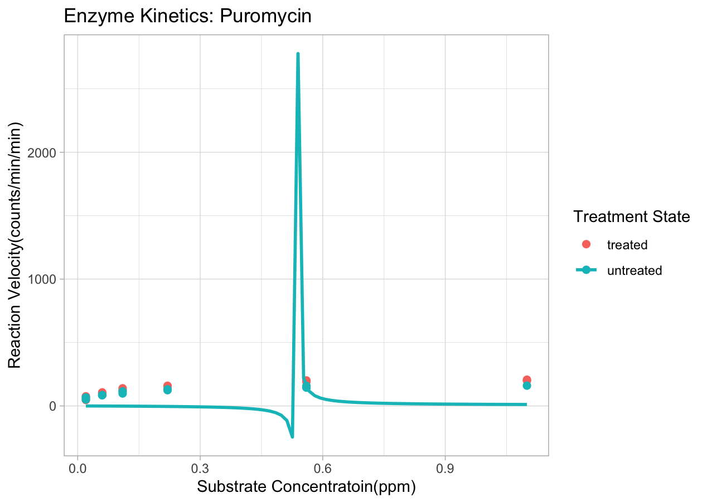
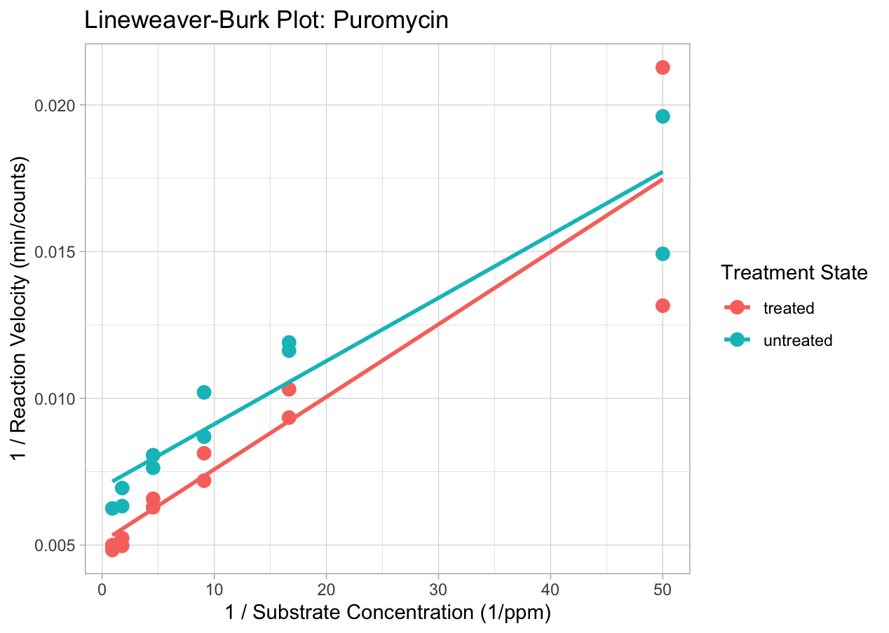

# Enzyme Kinetics Visualization: Puromycin Data Analysis

## Project Overview
Self-directed project emphasizing statisical analysis and visualization of enzyme kinetic relationship and behavior surrounding Puromycin

## Features
* Processes enzyme kinetics data from public databases.
* Generates accurate Lineweaver-Burk & Michaelis-Menten plots to visualize reaction rates.
* Computes pharmacokinetic parameters (Vmax, Km).

## Figures

## Michaelis–Menten Plot

## Lineweaver–Burk Plot

 

## Technologies & Tools
* **Language:** R
* **Libraries:** `ggplot2` (for visualization), `tidyverse` (for database), `dplyr` (for data manipulation)
* **Environment:** RStudio 

## Prerequisites
* R (version 4.0 or higher)
* RStudio
