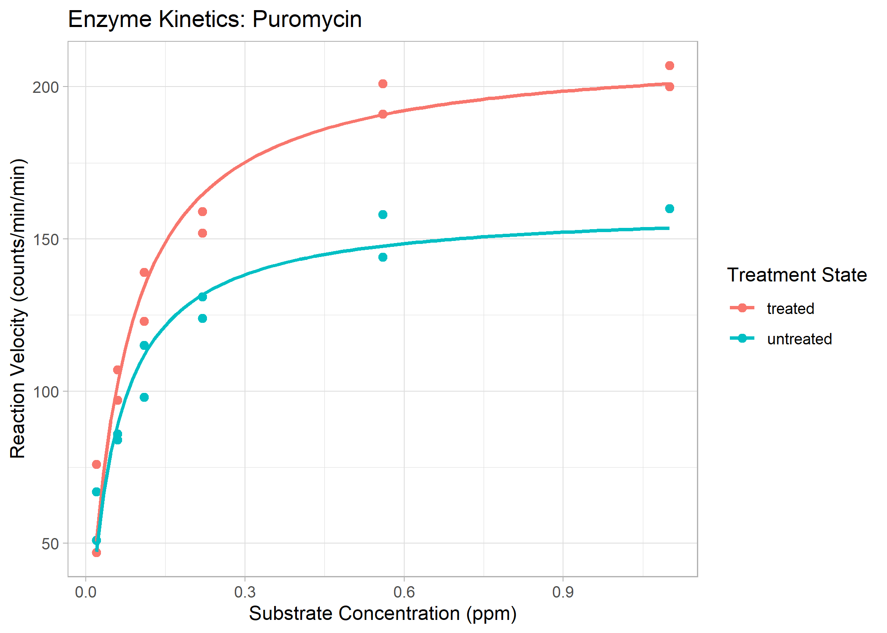
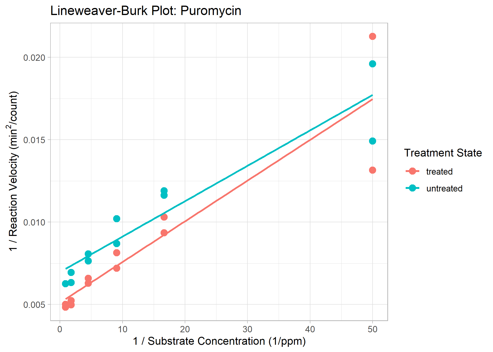
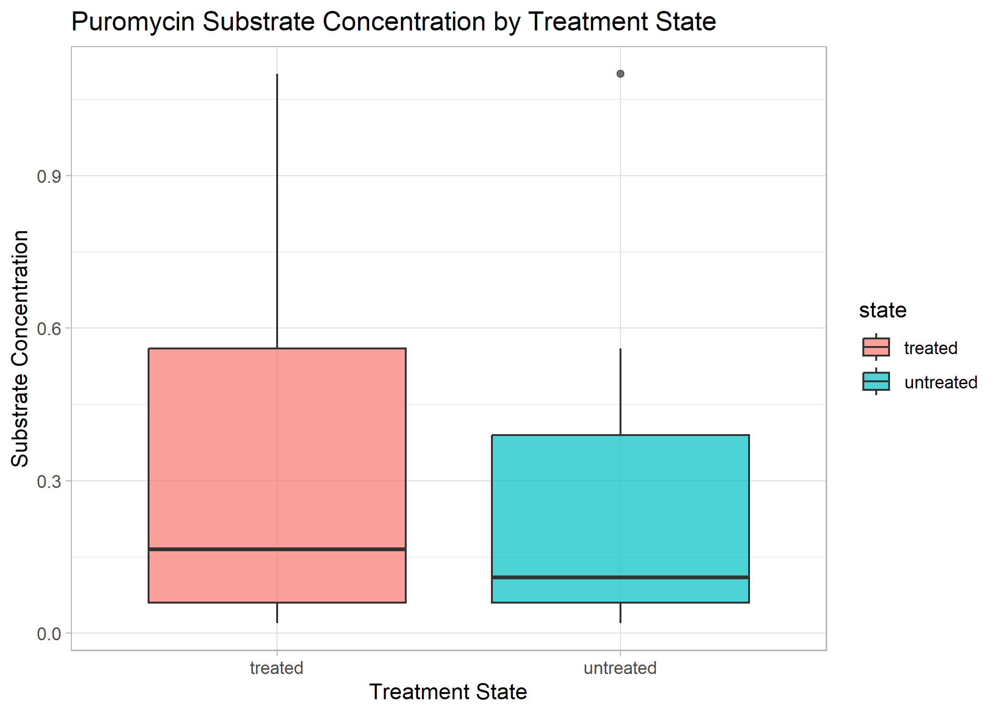
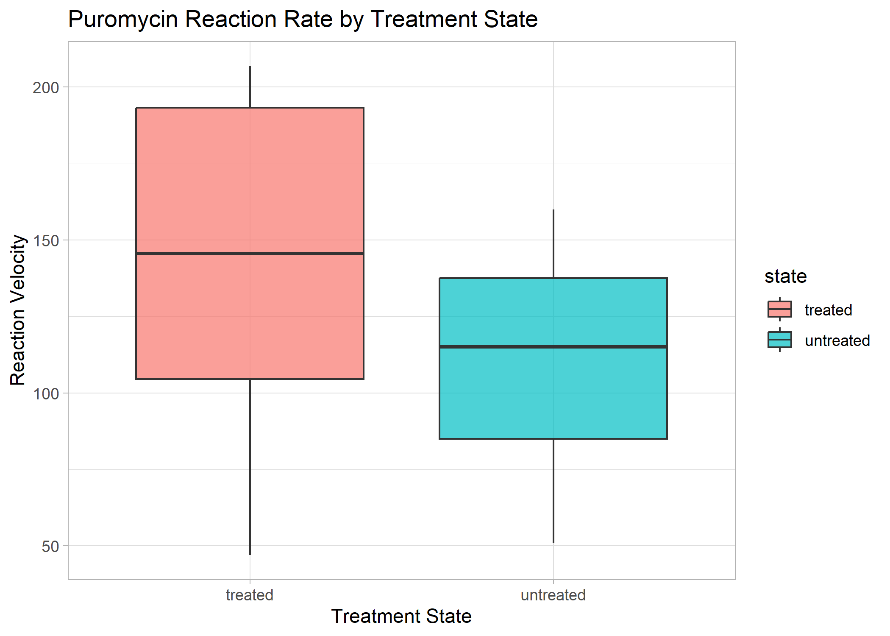
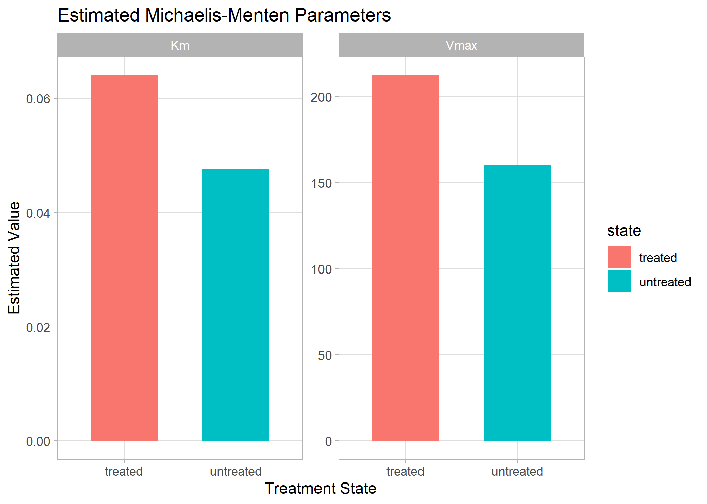
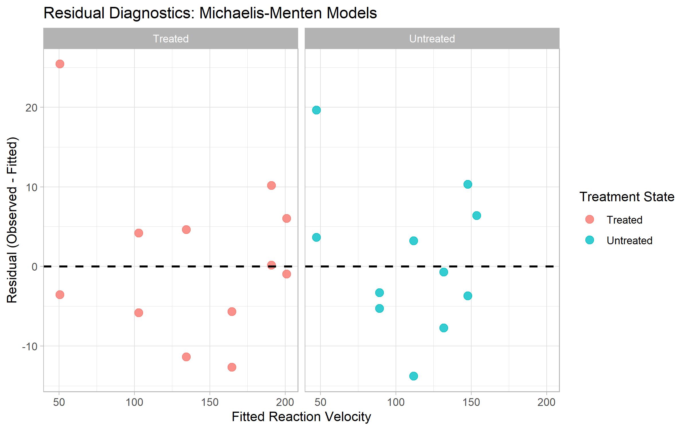

### Enzyme Kinetics Analysis: Puromycin
## Project Overview

A self-directed R project analyzing enzyme-kinetics data from R’s built-in Puromycin dataset. The project compares treated and untreated samples using Michaelis–Menten nonlinear regression, Lineweaver–Burk visualization, parameter estimation, descriptive statistics, residual diagnostics, and root mean square error.

## Features
* Load and analyze R’s built-in Puromycin enzyme-kinetics dataset.
* Fit separate Michaelis–Menten nonlinear regression models for treated and untreated samples.
* Estimate and compare (Vmax}) and (Km) values between treatment groups.
* Calculate 95% confidence intervals for fitted (Vmax}) and (Km) parameters.
* Generate Michaelis–Menten and Lineweaver–Burk plots.
* Calculate descriptive statistics for substrate concentration and reaction rate.
* Evaluate model fit using residual diagnostics and root mean square error.
* Produce clearly labeled scientific visualizations using ggplot2.

## Project Structure

```text
puromycin-enzyme-kinetics/
├── README.md
├── puromycin-enzyme-kinetics.Rproj
├── R/
│   └── puromycin_analysis.R
└── figures/
    ├── puromycin_conc_boxplot.png
    ├── puromycin_lineweaver_burk.png
    ├── puromycin_michaelis_menten.png
    ├── puromycin_rate_boxplot.png
    ├── puromycin_residuals.png
    └── puromycin_vmax_km_parameters.png
```

## Michaelis–Menten Plot Puromycin



## Lineweaver–Burk Plot Puromycin



## Concentratoin Boxplot Puromycin



## Rate Boxplot Puromycin



## Vmax and Km Parameters Puromycin



## Puromycin Michaelis-Menten Residual Plot



## Technologies & Tools
* **Language:** R
* **Libraries:** `ggplot2` (for visualization), `tidyverse` (for database), `dplyr` (for data manipulation)
* **Environment:** RStudio 

## Prerequisites
* R (version 4.0 or higher)
* RStudio
